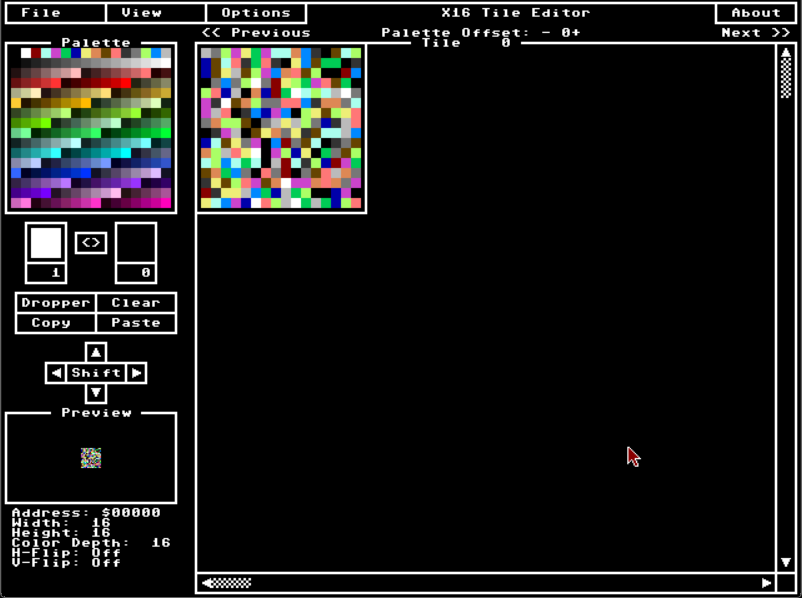
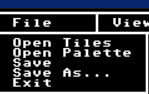
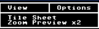
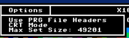
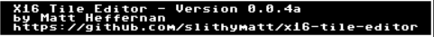
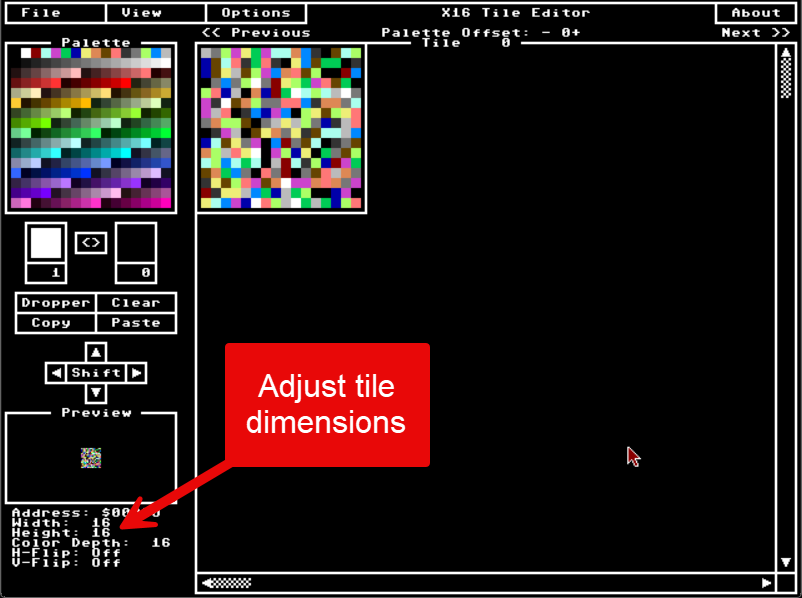

# Commander X16 Tile editor

## Introduction

This is the unofficial user's guide based on version 0.4a of tile editor

### using mouse
To use the mouse in  the tile editor add -capture to the command line of the emulator
or press the keys ' ctrl+m ' to enter the tile editor
press the keys ' ctrl+m ' to release the mouse from the tile editor.

## File menu

**open file**
open a file

**open palette**
open a palette

**save**
save the file

**save as**
save the file under a different name

**exit**
exit the application

## View menu

**tile sheet**

**zoom preview x2**

## options menu

**use PRG file headers**

**CRT mode**

**Max set size:**

app name and version  number
authors name
github site

## prev and next

allows navigation

## tile dimensions

allows the change of tile dimensions 16 x 16 etc.

## Acknowledgements

* Matt Heffernan Programmer fpr tile editor
* Paul Cavanagh documenter for the user guide